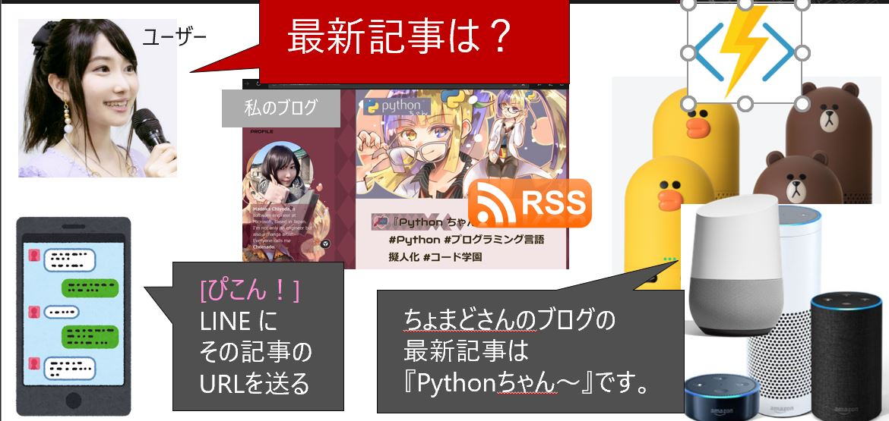
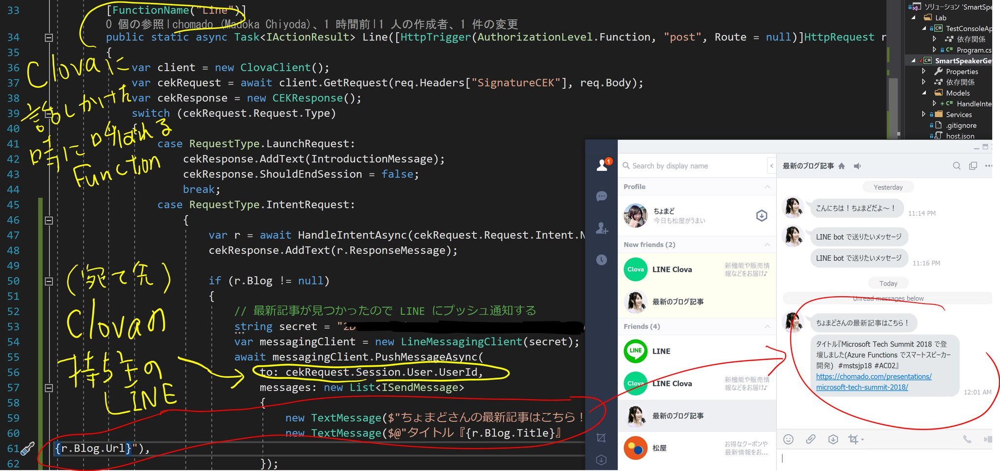
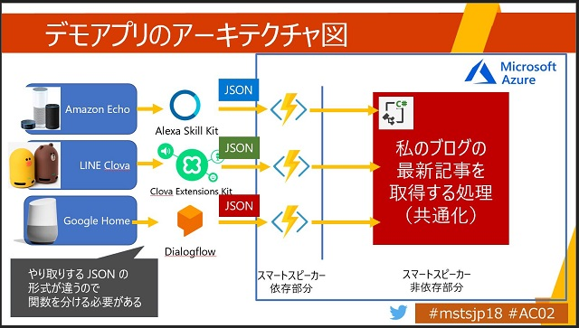

# スマートスピーカースキル『最新のブログ記事』

＊ ストアには提出していないので、ストアで検索しても無いです

(git clone したらやること→ [その1](https://twitter.com/chomado/status/1066737480672542720), [その2](https://twitter.com/chomado/status/1066738977871343616))

スマートスピーカーで [ちょまどブログ](https://chomado.com/author/chomado/)の最新記事を取ってきてくれる

1. ユーザー「最新の記事を教えて」
1. Azure Functions 発火
1. 私のブログ [chomado.com](https://chomado.com/author/chomado/) の RSS を読み込んで、最新記事のタイトルを取得する
1. スマートスピーカー（LINE Clova/ Google Home/ Amazon Alexa) が、そのタイトルを読み上げてくれる
1. LINE にメッセージも送ってくれる (LINE Clova の時のみ)

↓ CLova の持ち主に LINE も送ってくれる 

## アーキテクチャ

## 使用したもの

* LINE Clova Extensions Kit (CEK)
* LINE Messaging API
* [Microsoft Azure Functions](https://docs.microsoft.com/azure/azure-functions/?WT.mc_id=dotnet-0000-machiy) という、マイクロソフトのサーバーレスのサービス
* [LINE.Messaging](https://github.com/pierre3/LineMessagingApi) という、C# で LINE Messaging API を使うためのライブラリ
